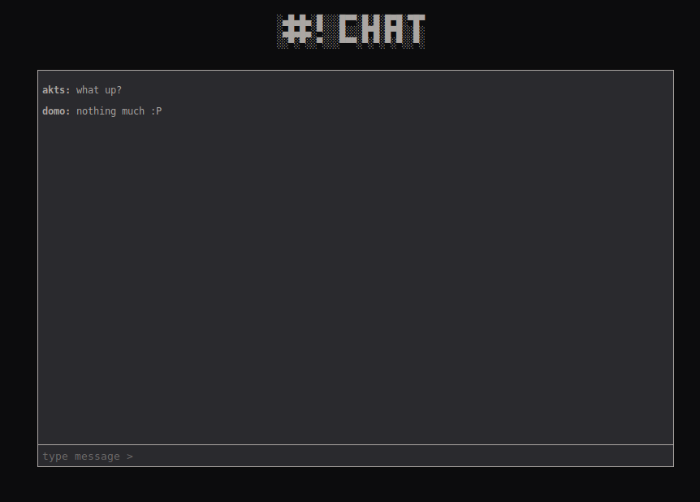

# Crunchchat

A tiny realtime chat app made with nodejs, express, socket.io and mongodb, made with the spirit of [crunchbang](https://en.wikipedia.org/wiki/CrunchBang_Linux).

See a live preview of it on [heroku](https://evening-citadel-98495.herokuapp.com/).

### To Run
 - Clone the repo.
  - Do an `$ npm install` 
  - Launch the app with `$ DBUSER=<user> DBPASS=<pass> node app`

### Credits
- [The Net Ninja ](https://www.thenetninja.co.uk/)  - Web sockets intro on [youtube](https://www.youtube.com/playlist?list=PL4cUxeGkcC9i4V-_ZVwLmOusj8YAUhj_9). 
 - [Traversy Media ](https://www.traversymedia.com/)  -  Mongo chat on [youtube](https://www.youtube.com/watch?v=8Y6mWhcdSUM).
  
### Todo
- Make a better README :rage4:
 - Refactor the app and make it deployment ready :exclamation:
